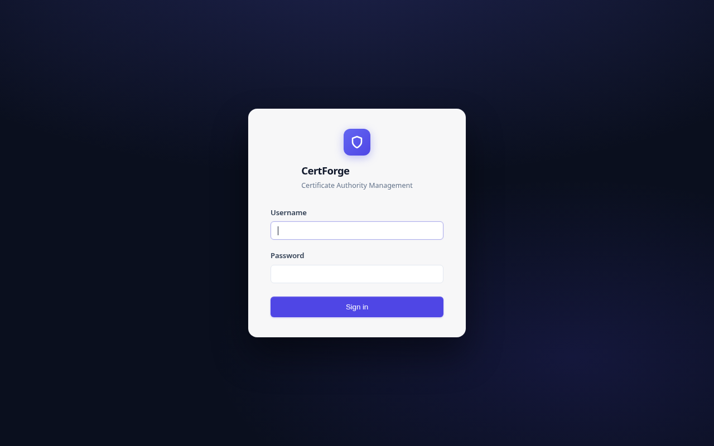
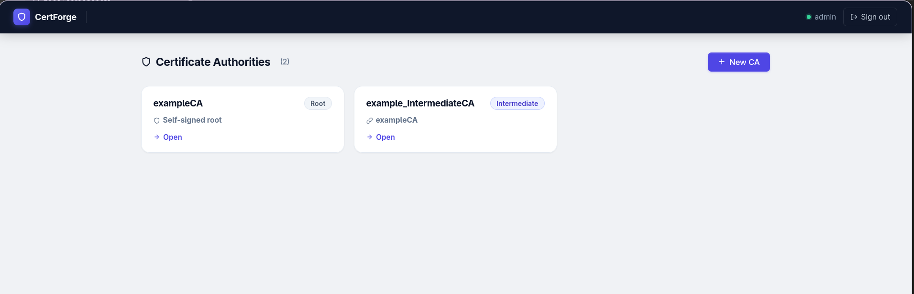
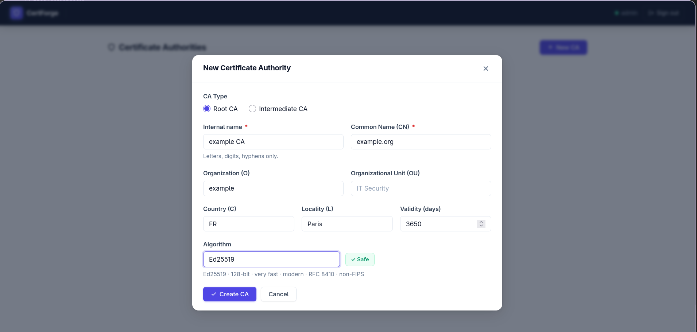
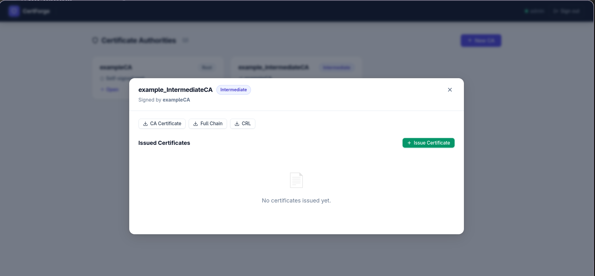
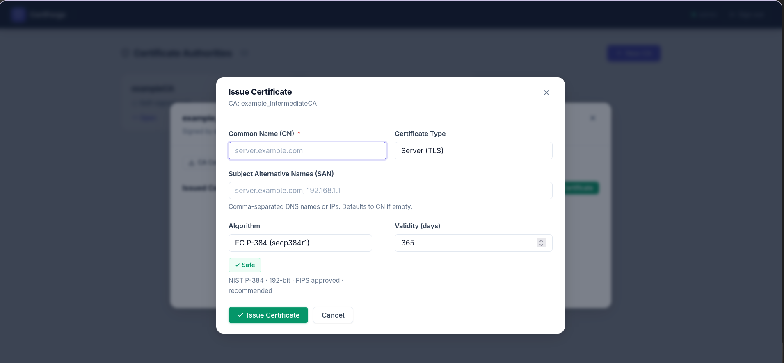
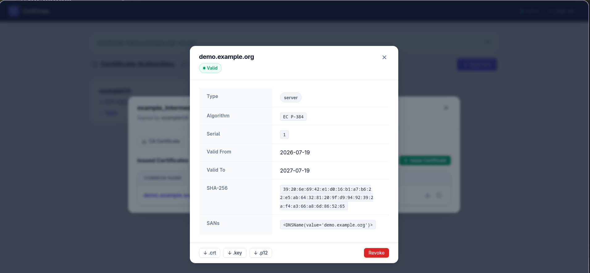

# CertForge

A complete PKI management toolkit available in two flavours:

| | CLI | Web UI |
|---|---|---|
| **Interface** | Bash scripts | Flask + Docker |
| **Backend** | OpenSSL | Python `cryptography` lib |
| **Algorithms** | RSA 4096, EC P-384 | RSA 2048/4096, EC P-256/P-384/P-521, Ed25519 |
| **Best for** | CI/CD, scripting, shell | Daily ops, team use, browser access |

---

## Project Structure

```
CertForge-OpenSSL/
├── cli/                        # Bash CLI (OpenSSL-based)
│   ├── bin/
│   │   ├── pki-ca              # CA management
│   │   ├── pki-cert            # Certificate generation
│   │   └── pki-crl             # CRL management
│   ├── lib/common.sh
│   ├── templates/ca.cnf.template
│   ├── examples/
│   └── pki                     # Main entry point
│
├── webapps/                    # Web UI (Docker)
│   ├── volumes/
│   │   ├── app/                # Flask source
│   │   │   ├── app.py
│   │   │   ├── config.py
│   │   │   ├── models.py
│   │   │   ├── routes.py
│   │   │   ├── services.py
│   │   │   ├── pki_engine.py
│   │   │   ├── utils.py
│   │   │   ├── static/
│   │   │   └── templates/
│   │   └── nginx/nginx.conf
│   ├── build/Dockerfile
│   ├── docker-compose.yml
│   └── .env                    # (gitignored — copy from .env.example)
│
├── .gitignore
└── README.md
```

---

## Web UI

A browser-based PKI manager with full CA hierarchy support, certificate issuance, CRL management, and AIA endpoints. Everything runs in Docker, all operations are done through modals — no page navigation.

### Screenshots

<table>
<tr>
<td align="center" width="50%">

<sub>Login</sub>
</td>
<td align="center" width="50%">

<sub>Dashboard — CA list</sub>
</td>
</tr>
<tr>
<td align="center" width="50%">

<sub>New Certificate Authority</sub>
</td>
<td align="center" width="50%">

<sub>CA detail — issued certificates</sub>
</td>
</tr>
<tr>
<td align="center" width="50%">

<sub>Issue Certificate</sub>
</td>
<td align="center" width="50%">

<sub>Certificate detail — download & revoke</sub>
</td>
</tr>
</table>

### Features

- Root CA and Intermediate CA creation
- Server (TLS) and Client (mTLS) certificate issuance
- Algorithms: RSA 2048/4096 · EC P-256 / P-384 / P-521 · Ed25519
- Certificate revocation + automatic CRL update
- PKCS#12 export (.p12)
- AIA / CRL Distribution Point URLs embedded in certificates
- Single-page UI — all actions in modals
- Public AIA endpoints (no auth) for OCSP-compatible clients

### Quick Start

```bash
cd webapps

# 1. Configure environment
cp .env.example .env
# Edit .env: set ADMIN_PASSWORD, SECRET_KEY, BASE_URL

# 2. Start
docker compose up -d

# 3. Open
open http://localhost
```

### Environment Variables (`.env`)

| Variable | Default | Description |
|---|---|---|
| `ADMIN_USER` | `admin` | Login username |
| `ADMIN_PASSWORD` | `changeme` | Login password — **change this** |
| `SECRET_KEY` | `change-this-secret-key-in-production` | Flask session key |
| `BASE_URL` | *(empty)* | Public base URL for AIA/CRL links (e.g. `https://pki.example.com`) |
| `PKI_DATA_DIR` | `/data` | Internal data directory (Docker volume) |

> Set `BASE_URL` to embed CRL and CA Issuers URLs in issued certificates.
> Without it, certificates are valid but have no distribution point extensions.

### Architecture

```
Browser → Nginx (80/443) → Gunicorn/Flask (5000) → /data (Docker volume)
```

The Flask app manages:
- PKI filesystem (`/data/ca/<name>/`) — keys, certs, CRL, chains
- SQLite database (`/data/pki.db`) — certificate index, users

### Public AIA Endpoints

These routes are accessible without authentication:

```
GET /aia/<ca_name>/ca.crt     → CA certificate (DER, for AIA CA Issuers)
GET /aia/<ca_name>/crl.crl    → CRL (DER, for distribution points)
```

### Algorithm Support

| Algorithm | Strength | Notes |
|---|---|---|
| EC P-384 | 192-bit | FIPS approved · recommended default |
| EC P-521 | 260-bit | FIPS approved · strongest NIST curve |
| Ed25519 | 128-bit | Very fast · RFC 8410 · not FIPS |
| EC P-256 | 128-bit | Maximum compatibility |
| RSA 4096 | Strong | ~10× slower than EC |
| RSA 2048 | Minimum | Legacy use only |

---

## CLI

Bash scripts using OpenSSL directly. No dependencies beyond `openssl` and `bash`.

### Prerequisites

```bash
openssl version   # 1.1.1+
bash --version    # 4.0+
```

### Quick Start

```bash
cd cli

# Create a CA
./pki ca create -p myproject -a ec

# Issue a server certificate
export CRT_SAN="DNS:api.example.com,IP:192.168.1.10"
./pki cert -p myproject -t server -a ec -n "api.example.com"

# Issue a client certificate
./pki cert -p myproject -t client -a ec -n "John Doe"

# Revoke + update CRL
./pki crl -p myproject -r 01 -u
```

### Commands

#### `pki ca create` — Create a Certificate Authority

```bash
./pki ca create -p <project> -a <ec|rsa>
```

**Options:**

| Option | Required | Description |
|---|---|---|
| `-p <name>` | Yes | Project name (creates directory) |
| `-a <algo>` | Yes | `ec` (secp384r1) or `rsa` (4096-bit) |

**Environment variables:**

| Variable | Default | Description |
|---|---|---|
| `CA_C` | `FR` | Country code (2 letters) |
| `CA_L` | `Paris` | Locality |
| `CA_O` | `France` | Organization |
| `CA_OU` | `DevOps` | Organizational Unit |
| `CA_CN` | project name | Common Name |
| `CA_EXPIRE_DAYS` | `365` | CA validity (days) |
| `CRL_EXPIRE_DAYS` | `30` | CRL validity (days) |

**Generated files:**
```
myproject/
├── ca.key          # CA private key (password-protected, chmod 400)
├── ca.crt          # Self-signed CA certificate
├── ca.pass         # CA key password (randomly generated)
├── ca.cnf          # OpenSSL configuration
├── ca.srl          # Serial counter
├── index.txt       # Certificate database
├── crlnumber
├── crl/ca.crl      # Certificate Revocation List
└── newcerts/       # Copies of issued certs
```

---

#### `pki cert` — Generate Certificates

```bash
./pki cert -p <project> -t <server|client> -a <ec|rsa> [-n <CN>] [-c <cnf>]
```

**Options:**

| Option | Required | Description |
|---|---|---|
| `-p <name>` | Yes | Project name (must match an existing CA) |
| `-t <type>` | Yes | `server` or `client` |
| `-a <algo>` | Yes | `ec` or `rsa` |
| `-n <CN>` | No | Common Name |
| `-c <file>` | No | Custom OpenSSL `.cnf` file |

**Environment variables:**

| Variable | Default | Description |
|---|---|---|
| `CRT_C` | `FR` | Country code |
| `CRT_L` | `Paris` | Locality |
| `CRT_O` | *(from CA)* | Organization |
| `CRT_OU` | `DevOps` | Organizational Unit |
| `CRT_EXPIRE_DAYS` | `365` | Validity (days) |
| `CRT_SAN` | — | Subject Alternative Names |

**SAN format:**
```bash
export CRT_SAN="DNS:example.com,DNS:www.example.com,DNS:*.example.com,IP:192.168.1.1"
```

**Generated files (server):**
```
serverCertificate_<timestamp>_<cn>.key      # Private key (passwordless)
serverCertificate_<timestamp>_<cn>.crt      # Public certificate
serverCertificate_<timestamp>_<cn>.p12      # PKCS#12 bundle
serverCertificate_<timestamp>_<cn>.p12.pass # .p12 password
```

---

#### `pki crl` — Manage Revocation

```bash
./pki crl -p <project> [-r <serial>] [-u]
```

| Option | Description |
|---|---|
| `-p <name>` | Project name |
| `-r <serial>` | Serial number to revoke (hex, e.g. `01`) |
| `-u` | Update/regenerate the CRL |

**Find a serial number:**
```bash
openssl x509 -in certificate.crt -noout -serial
# or
cat myproject/index.txt
```

---

### Common Use Cases

**Internal web server with wildcard:**
```bash
export CA_O="ACME Corp" CA_EXPIRE_DAYS=1825
./pki ca create -p internal -a ec

export CRT_SAN="DNS:*.acme.internal,DNS:acme.internal"
./pki cert -p internal -t server -a ec -n "*.acme.internal"
```

**mTLS client certificates:**
```bash
export CRT_O="ACME Corp" CRT_OU="Engineering"
./pki cert -p internal -t client -a ec -n "Alice Martin"
./pki cert -p internal -t client -a ec -n "Bob Dupont"
```

**LDAP / AD server:**
```bash
export CRT_SAN="DNS:ldap.corp.local,IP:192.168.1.10"
./pki cert -p internal -t server -a ec -n "ldap.corp.local"
```

---

## Security Notes

- **Never commit** `.key`, `.pass`, or `.env` files — they are gitignored
- The CA private key is the root of trust — back it up in an encrypted location
- Change `ADMIN_PASSWORD` and `SECRET_KEY` before any production deployment
- Use HTTPS (set `BASE_URL` with `https://`) in production
- For production CAs, consider an HSM for key storage
- Restrict access to the Docker host — the web UI has no multi-user RBAC

---

## License

See [LICENSE](LICENSE).
